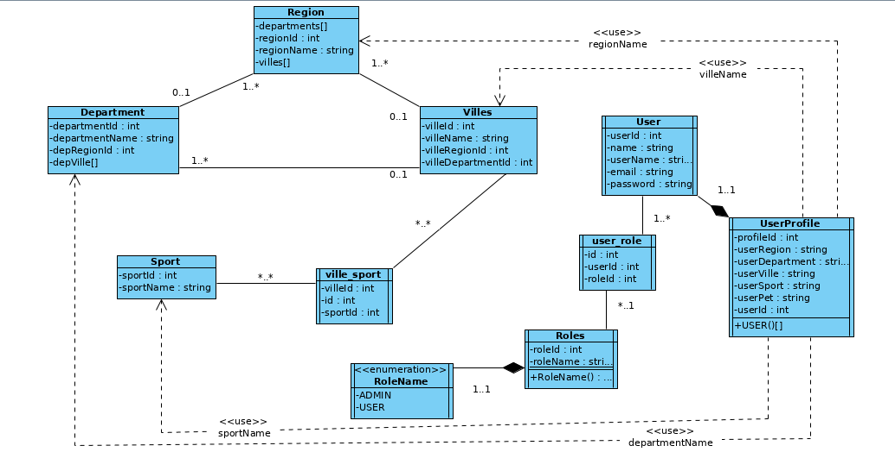

# WEEKEND GET AWAY PROJECT

# Descriptions
 * This project is a small application used for traveling.  
 The project is made of **Four parts**:  
 * The Back end section ([Java -Spring Boot, and JAP](https://www.javainuse.com/spring/boot-jwt-mysql)), which use built using **Intellij IDEA**.
 * The Front end section ([Angular 8](https://angular.io)), also built using **Visual Studio Code**.
 * The database in phpMyAdmin (MySQL database) running on [Docker](https://blog.thenets.org/how-to-install-mysql-and-phpmyadmin-with-docker/).
 * The Swagger section [Swagger](http://localhost:9002/swagger-ui.html#/), used in viewing all the application API. This can only be seen once the application is running.

## Installation

Getting started with [spring boot](https://start.spring.io/), adding all needed library such as Spring Data JPA, Spring Security, and SQL Server Driver.  
If you want to clone this project, make sure to do :

```bash
npm install 
```
This will automatically install all necessary libraries and dependencies.  

Once this is done, make sure to deploy your database (phpMyAdmin) using Docker, or else, you will result in an error case.  
 
A [proxy.conf.json](weekend-project-front/proxy.conf.json) was added to the frontend section for easy running of the application.  

To run the frontend section of the application after cloning do :
```bash
npm start 
```

# About the Application
* There are two **Authentication Access** to this application.  
The first is the **ADMIN ACCESS**, and the second is the **USER ACCESS**.

The **Administrator** has access to all important API in the application, while a user has access to only necessary APIs.  

The applications can also send email to the users email address with the user's registered email address of **SMTP GMAIL**.  
* In order for this section to work on your computer, you need to configure your **Gmail Account** to accept SMTP.  
* If this is not done, on running the application, the application will result in an **ERROR**.

  

The standard **[CRUD](https://dzone.com/articles/build-a-simple-crud-app-using-spring-boot-mysql-an)** method was done in this application. that is :  
* C = Creat (POST)
* R = Read (GET)
* U = UpDate (PUT)
* D = Delete (DELETE).  

The tool call **[POSTMAN](https://www.getpostman.com/)** was used to test each **URL Link**.  
An **administrative profile** can only be added (registered) with the use of postman, but an administrator can login to the application like every other users.  
To registered a **User (Administrator)**, we do the following:  
```bash
{
	"name": "Thomas James",
	"username": "thomas0206",
	"email": "abibabe0206@gmail.com",
	"role":[
		"admin"
		],
	"password":"thomas0206"
} 
```


## Project Diagram
The flow chat diagram below shows the over view of how the application works.  
  


## Project UML Diagram
Below is the UML diagram of the project.
  


## Help Guides on Spring boot, JPA, REST APIs and MySQL
[HELP.md](HELP.md).  


## TREE OF THE WHOLE PROJECT
[PROJECT_TREE.md](backendList.md).  


## Contributing
Pull requests are welcome. For major changes, please open an issue first to discuss what you would like to change.

Please make sure to update tests as appropriate.


**_Thank you so much for reading! ☺_**
