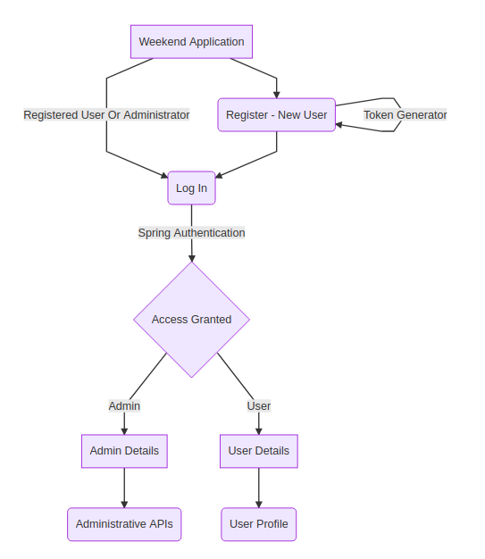

# WEEKEND GET AWAY PROJECT

# Descriptions
 * This project is a small application used for traveling.  
 The project is made of Four parts:  
 * The Back end section ([Java -Spring Boot, and JAP](https://www.javainuse.com/spring/boot-jwt-mysql)).
 * The Front end section ([Angular 8](https://angular.io)).
 * The database in phpAdmin running on [Docker](https://blog.thenets.org/how-to-install-mysql-and-phpmyadmin-with-docker/).
 * The Swagger section [Swagger](http://localhost:9002/swagger-ui.html#/), used in viewing all the application API. This can only be seen one the application is running.

## Installation

Getting started with [spring boot](https://start.spring.io/), adding all needed library such as Spring Data JPA, Spring Security, and SQL Server Driver.  
If you want to clone this project, make sure to do :

```bash
npm install 
```
This will automatically install all necessary libraries.  
A [proxy.conf.json](weekend-project-front/proxy.conf.json) was added to the frontend section for easy running of the application.  

To run the application after cloning do :
```bash
npm start 
```

# About the Application
* There are two **Authentication Access** to this application.  
The first is the **ADMIN ACCESS**, and the second is the **USER ACCESS**.

The **Administrator** has access to all important API in the application, while a user has access to only necessary APIs.

## Project Diagram
The diagram below shows the over view of how the application works.  



## Contributing
Pull requests are welcome. For major changes, please open an issue first to discuss what you would like to change.

Please make sure to update tests as appropriate.


Thank you so much for reading! ☺

[HELP.md](HELP.md)

## TREE OF THE WHOLE PROJECT
[PROJECT_TREE.md](backendList.md)